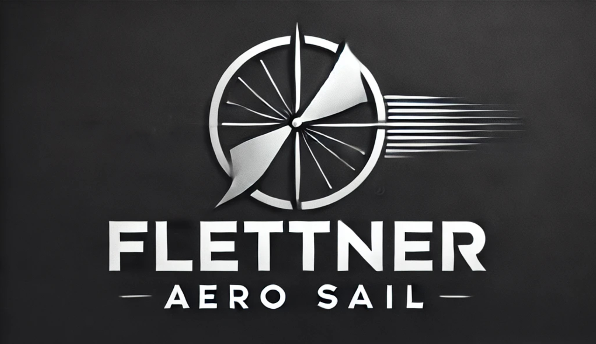

<p align="center">
  
</p>

# Flettner-Aero-Sail  
*Remote-controlled catamaran powered by a Flettner rotor (HTL diploma project Flettner Aero Sail 2025)*
<p align = "center">
  
</p>

---


## What this repo contains
| Folder | Content |
|--------|---------|
| [/controller](/controller)            | Arduino-ESP32 source for the hand-held controller |
| [/boat](/boat)                        | Arduino-ESP32 source for the on-board MCU |
| [/hardware/CAD](/hardware/CAD)        | Fusion 360 models (`.f3d`) and printable STLs of hull, rotor & enclosure |
| [/hardware/Wiring](/hardware/Wiring)  | PDF schematics and pin-out drawings |
| [/docs](/docs)                        | Excerpts of the thesis, test logs, pool-trial photos |

---

## Project at a glance
|    |    |
|----|----|
| **Propulsion** | 3-D-printed Flettner rotor (Ø 61 mm × 263 mm) driven by a 2200 KV brushless DC motor |
| **Hull** | 500 mm × 300 mm catamaran → high stability & shallow draft |
| **Control link** | **ESP-NOW** (direct peer-to-peer, < 2 ms latency, optional AES-128) |
| **Hand-held TX** | 2-axis joystick (rudder) • rotary encoder w/ push (rotor RPM) • 128×32 px OLED |
| **On-board RX** | ESC 40 A bidirectional for rotor • high-torque servo DS3218 for rudder |
| **Materials** | PETG HF (hulls), PLA Matte (rotor), ASA CF (rotor mount), TPU ( gaskets ) – all printed on a Bambu Lab P1S |
| **Field tests** | Validated in a self-built water tank; detailed logs and video in `/docs/tests` |

---

## Key features
- **Magnus-effect drive** &nbsp;— explore an alternative, low-noise propulsion concept  
- **Full open hardware** &nbsp;— CAD files, STL, wiring, bill of materials included  
- **Low-latency radio** &nbsp;— robust control up to ~ 120 m without any router  
- **Inline failsafe** &nbsp;— programmable watchdog → neutral rudder & motor stop if link lost  
- **Config via `static constexpr`** &nbsp;— all pin maps & time-outs in one header, easy to port  
- **Modular build** &nbsp;— hull halves, rotor and controller can be re-printed or replaced separately  

---

## Quick start

### 1 · Clone
```bash
git clone https://github.com/skramperger/Flettner-Aero-Sail.git
```

### 2 · Hardware
1. Print the parts listed in `/hardware/CAD/print-list.md`.  
2. Assemble the catamaran, mount the brushless motor & timing belt, insert the rotor shaft.  
3. Wire the ESP32 boards exactly as in `/hardware/wiring/boat.pdf` and `/hardware/wiring/controller.pdf`.  
4. **Important:** read the MAC address of each ESP32 (see `tools/read_mac.ino`) and paste it into the corresponding `config.h`.

### 3 · Firmware
The repo uses **PlatformIO**, but the sketches also build in the Arduino IDE.


